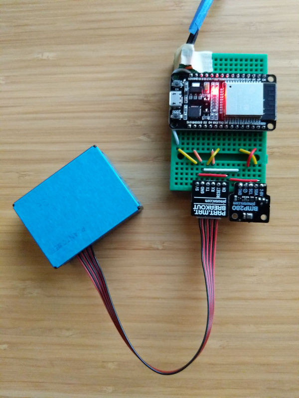

# ESParticle - an ESP32-based environmental sensor

## Overview

After being housebound for 2 weeks by the September 2020 west coast wildfires, I decided that I wanted a way to measure conditions outside of my house and record them over time. I built the ESParticle to measure particle count in the air, as well as temperature and pressure. It's loosely based on the [Sensorbot](http://www.sensorbot.org/).

The hardware consists of ESP32 with a BMP280 Temp/Altitude/Pressure sensor and a PMS5003 particle sensor. The ESP sends periodic data to a [Thingsboard server on a Raspberry Pi](https://thingsboard.io/docs/user-guide/install/rpi/), which, and hosts a website on the local network with plots of the logged data.

## Software

Install the software using [PlatformIO](https://platformio.org/). I've provided a sample "example-secrets.h" file that should be copied to "secrets.h" and edited with your wifi and Thingsboard information.

I've added a fudge factor value to the altitude sea level configuration, so you will need to edit the value to get accurate pressure readings.

I mounted the whole thing in a waterproof enclosure with holes drilled for air intake, and it's given me steady performance for 6 months at the time of this writing.